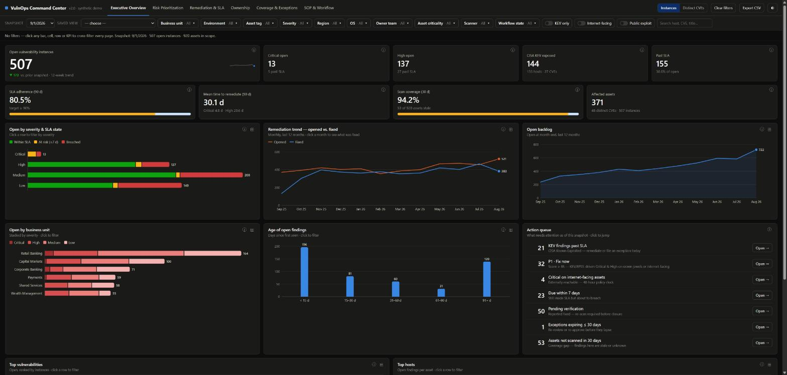
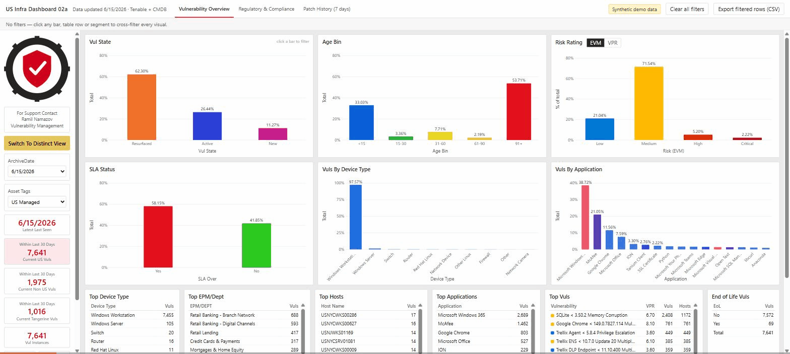
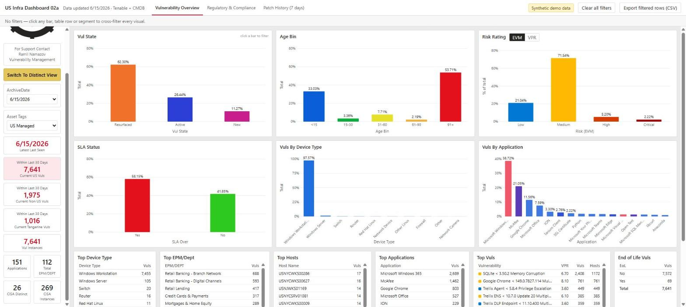
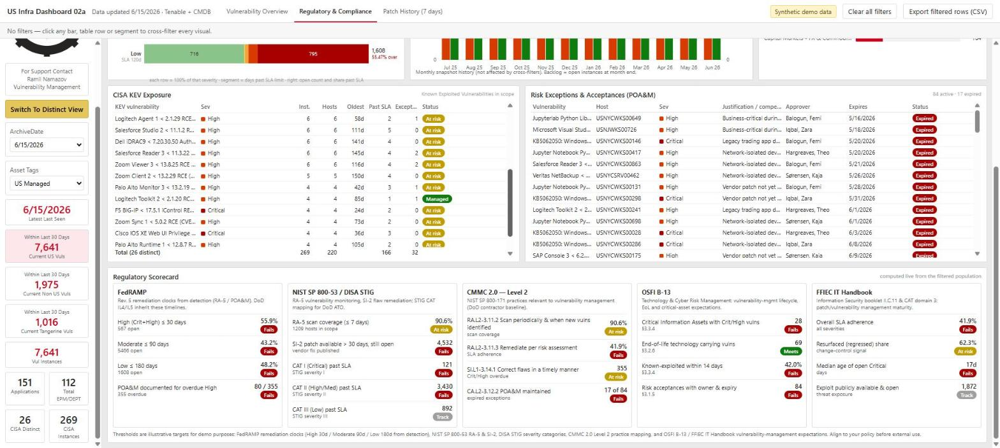
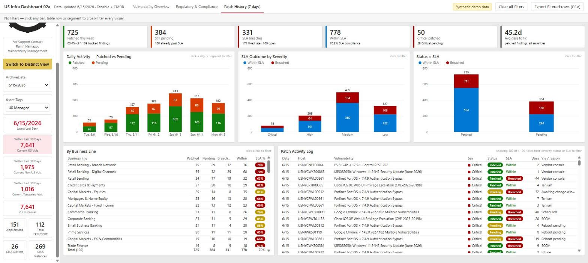

# US Infrastructure Vulnerability Dashboard

**[v2 — VulnOps Command Center →](https://ramilnamazov.github.io/VulnManagment_Powerbi/v2/)** · **[v1 — Power BI-style dashboard →](https://ramilnamazov.github.io/VulnManagment_Powerbi/)**

## Version 2 — VulnOps Command Center

The same idea rebuilt the way a vulnerability-management lead actually runs the program: six pages, one filter bar, and every number defined in place.



- **Executive Overview** — open findings with 12-week trend and delta vs. prior snapshot, Critical / High / CISA KEV / past-SLA tiles, SLA adherence, MTTR, scan coverage, and an **Action queue** that jumps to the right page with the right filters already applied
- **Risk Prioritization** — a documented priority score (severity + EPSS + KEV + asset tier + exposure), CVSS-vs-EPSS scatter with KEV emphasised, severity × asset-criticality heatmap, and a prioritized remediation queue
- **Remediation & SLA** — adherence by severity against a 90% target, MTTR, breach aging, monthly opened vs. fixed, backlog composition, due-in-7-days, team velocity
- **Ownership** — by-team stacks, team SLA adherence, team × age heatmap, live ServiceNow-style pipeline, accountability leaderboard
- **Coverage & Exceptions** — scan / credentialed / agent coverage, EOL platforms, last-scan age, exceptions by justification and expiry, full POA&M register
- **SOP & Workflow** — SLA policy, escalation matrix, 8-step runbook, weekly cadence, metric definitions, RACI, glossary

**Slicers & dicers:** weekly snapshot picker that replays history (every metric recomputes as-of that date), saved views, ten multi-select dimensions with live counts, KEV / internet-facing / public-exploit toggles, search, an Instances ⇄ Distinct-CVEs toggle, filter chips, CSV export, light/dark, a table-view twin on every chart, and an **ⓘ button on every card and KPI** that explains what it shows and exactly how it is calculated.

Still a single self-contained HTML file with zero dependencies. Severity uses a single-hue red ramp instead of red/orange/yellow because the classic scale fails colorblind-safety checks (orange ↔ yellow is indistinguishable for deutan viewers). All data is synthetic.

---

## Version 1 — Power BI-style dashboard

A Power BI-style vulnerability management dashboard, rebuilt as a single self-contained HTML file so anyone can open it in a browser — no Power BI license, no data gateway, nothing to install. Built to show what a security/IT team would actually look at day to day: what's critical, what's overdue, and what's on the CISA KEV list.



All data is **synthetic** — generated to look and behave like a real vuln-management export, with no real assets, hosts, or CVEs tied to any organization.

## What's in it

| Vulnerability Overview | Regulatory & Compliance | Patch History (7 days) |
|---|---|---|
|  |  |  |

- **Vulnerability Overview** — KPI tiles (open findings, critical/high counts, CISA KEV exposure), severity breakdowns, and asset-tag distribution (US Managed / Non-US Managed / Tangerine)
- **Regulatory & Compliance** — SLA breach aging by severity, a 12-month remediation trend, CISA KEV exposure, open risk exceptions (POA&M), and a scorecard mapped to FedRAMP, NIST SP 800-53, CMMC 2.0, OSFI B-13, and FFIEC
- **Patch History (7 days)** — daily patched-vs-pending activity, SLA outcome by severity, and a filterable patch activity log by business line

## Why it's interactive, not a screenshot

- **Cross-filtering** — click a bar, KPI tile, or table row and every chart on the page recalculates against that slice, exactly like Power BI's cross-filter behavior (see the GIF above)
- **Filters persist across pages** — filter on the Overview page, switch to Compliance or Patch History, and the same filter is still applied
- **Filter chips** — active filters show as removable chips along the top, with one-click "Clear all filters"
- **Real drill-down tables** — Top Hosts, Top Vulns, CISA KEV Exposure, Risk Exceptions (POA&M), and a 1,000+ row Patch Activity Log, all filterable
- **CSV export** — "Export filtered rows" dumps the currently filtered slice
- Runs entirely client-side: plain HTML/CSS/JS, no build step, no external libraries, no backend

## Run it locally

Just open `index.html` in any browser — or clone the repo and double-click the file:

```bash
git clone https://github.com/ramilnamazov/VulnManagment_Powerbi.git
cd VulnManagment_Powerbi
start index.html   # macOS: open index.html
```

## Stack

HTML5, CSS3, vanilla JavaScript. Styled to match the Power BI / Fluent UI look and feel (Segoe UI, Fluent color tokens, report-page chrome).
